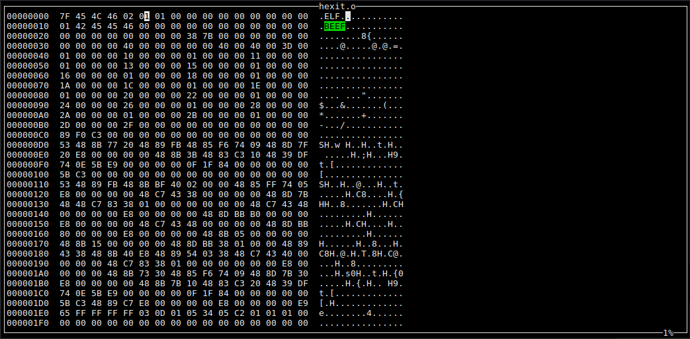

# hexit
A minimalistic hex editor.

#### Controls

| Key                           | Function        |
|-------------------------------|-----------------|
| S                             | Save the file.  |
| Arrows(up,down,left,right)    | Move the cursor.|
| 0-9 and A-F                   | Change the value of the nibble that the cursor points to. |

### Prerequisites

Make sure you have all of the following packages installed.
* g++-5 or greater
* make
* libncurses-dev

### Compile
1. git clone https://github.com/marprok/hexit.git
2. cd hexit
3. make

### Limitations

* As it is now, hexit will attempt to load the entire file in memory.
* You can only edit the file in binary mode and not in ASCII mode.
* You can not jump to different parts of the file.
* With hexit you can edit only a file at a time.
