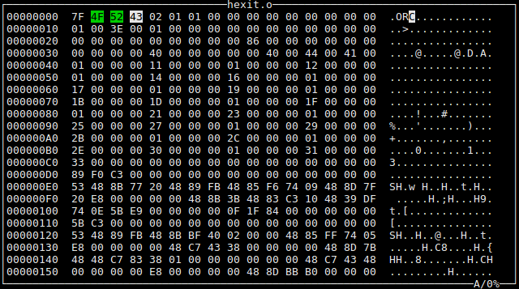

# hexit
A minimalistic hex editor.

HEX mode                   |  ASCII mode
:-------------------------:|:-------------------------:
  |  

### Controls

| Key                           | Function        |
|-------------------------------|-----------------|
| ctrl-s                        | Save the file.  |
| ctrl-x                        | Toggle HEX mode.|
| ctrl-a                        | Toggle ASCII mode.|
| ctrl-q                        | Exit the editor.|
| ctrl-g                        | Go to byte.|
| Arrows(up,down,left,right)    | Move the cursor.|
| Page-up/Page-down             | Move the page up/down.|
| Hexadecimal digits(HEX mode)  | Change the value of the nibble that the cursor points to.|
| Printable ASCII characters(ASCII mode) | Change the value of the byte that the cursor points to.|

### Prerequisites

Make sure you have all of the following packages installed.
* gcc(c++-20 support is needed)
* Make
* CMake(3.23 or greater)
* libncurses-dev

### Compile
1. git clone https://github.com/marprok/hexit.git
2. cd hexit
3. mkdir build && cd build
4. cmake -DCMAKE_BUILD_TYPE=Release ..
5. make

### Limitations
* With hexit you can edit only one file at a time.
